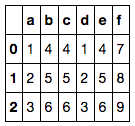
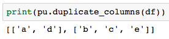

```python
duplicate_columns(df) 
```

Input:
* df: target dataframe

Output:
* list of lists, each sublist is a group of columns with the same value (any column which doesn't repeat with other columns is not included) 

Example:    

df =   
   

  
