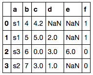

```python
gpby(df, gp_feature, aggr_feature, aggr_func, join = True)
```

Input:
df:  target dataframe
gp_feature: the feature to perform group by
aggr_feature: the feature to perform aggregation function
aggr_func (aggregation function): 'unique_count', 'count', 'mean', 'max', 'min', 'sum', 'list'
join: True:   join the 'new group by table' to original table (df)
      False:  return the 'new group by table' only
Example:  

df =   
   


```python
gpby_range(df, gp_feature, aggr_feature, aggr_func, value_list)
```
