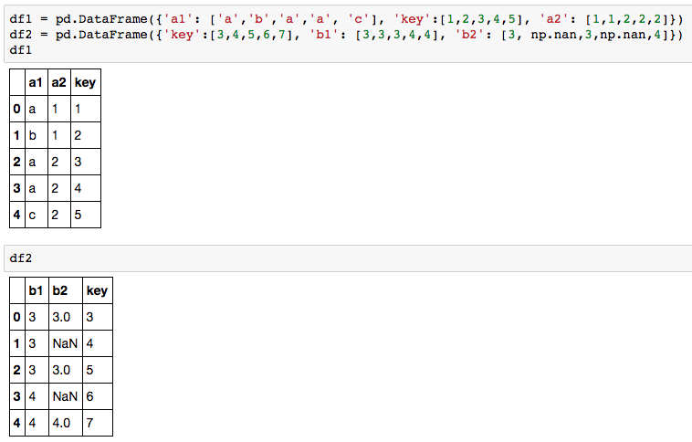
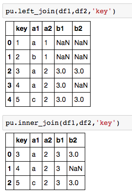
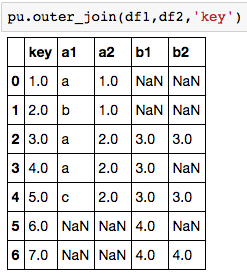

```python
left_join(df1, df2, key)    
inner_join(df1, df2, key)    
outer_join(df1, df2, key)   
```

Input:
* df1, df2: pandas dataframe to be joined
* key:      the join key, a string

Output:
* Pandas dataframe storing the joined result

Example:    
  
   

  

  
