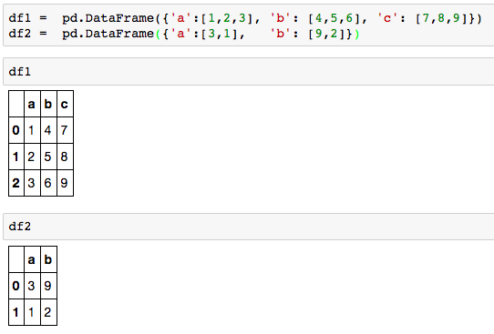
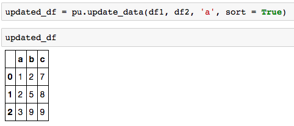

```python
update_data(df1, df2, key_column, sort = True)
```

Input:
* df1: target dataframe to be updated    
* df2: used to update df1. Make sure all columns in df2 are in df1.  
* key_column: the column used to match df1 and df2  
* sort: True:  output sorted revised dataframe by key_column   
        False: output revised dataframe, not sorted  
    
Output:
* updated dataframe

Example:    
  
   

  
