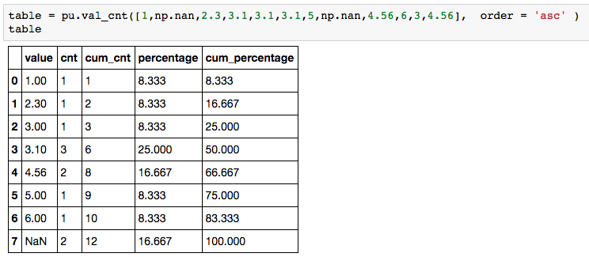
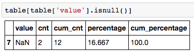
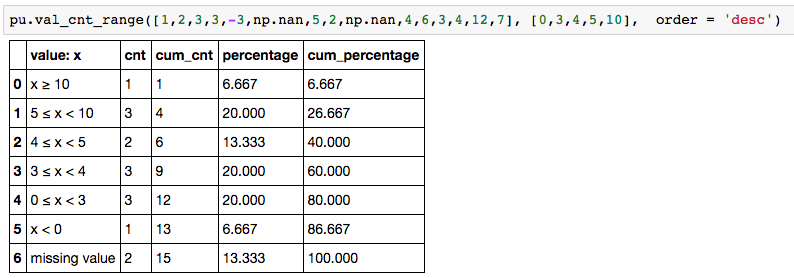

```python
val_cnt(value_list, details = True, var_name='value', order='asc', precision=3)
```

Input:  
* value_list: The target list / np.array / pandas series which we would like to see distribution.   
    If the input type is not pd.Series, type transformation will be performed.  
* details:    If False, then only the 'count' stats is displayed  
* var_name:   User defined variable name
* order:      Whether we'd like to see the stats in asc or desc order 
* precision:  Number of digits to be displayed when calculating for percentages  
    
Output:            
* distribution stats dataframe   

```python
val_cnt_range(value_list, range_list, details = True, var_name='value', order='asc', precision=3)
```

Input:
* range_list:  The list where the range of each group is based on. Will be sorted in ascending order.  
* All other variables are the same from above.  

Output: 
* Same from above. 

Example:    

   

In case the table is long, you can always use this command to check out missing values.
  

  


