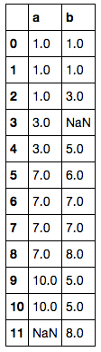
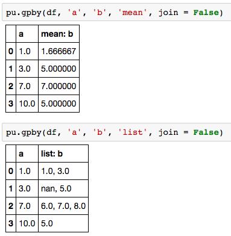
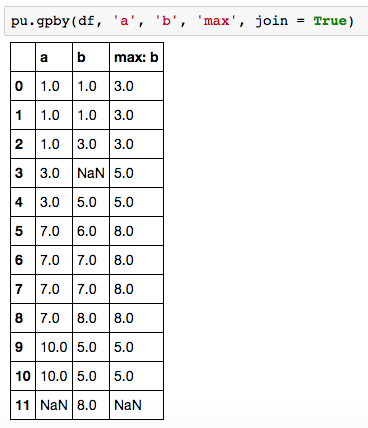
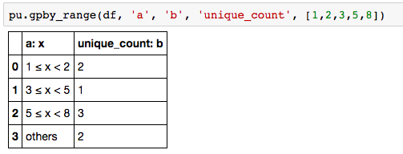

```python
val_cnt(value_list, details = True, var_name='value', order='asc', precision=3)
```

Input:  
* value_list: The target list / np.array / pandas series that we would like to see distribution. 
    If the input type is not pd.Series, type transfermation will be performed.  
* details:    If False, then only the 'count' stats is displayed  
* var_name:   User defined variable name
* order:      Whether we'd like to see the stats in asc or desc order 
* precision:  Number of digits to be displayed when calculating for percentages  
    
Output:            
* distribution stats dataframe   

```python
val_cnt_range(value_list, range_list, details = True, var_name='value', order='asc', precision=3)
```

Input:
* df, gp_feature, aggr_feature, aggr_func: same from above. 
* range_list: the list where the range of each group is based on. Will be sorted in ascending order.

Example:    

df =   
   

Peforming 'mean' aggregation. Missing values will be ignored except when aggr function = 'list'. 
  

if join = True, then the resulting dataframe will be joined back to the original dataframe. 
  

by setting up value list, groups are split based on it. Missing values and Values outside of the range specified by value list will go to 'others' group.  Also, if no value exist in a group, that group will not be displayed.  
  
